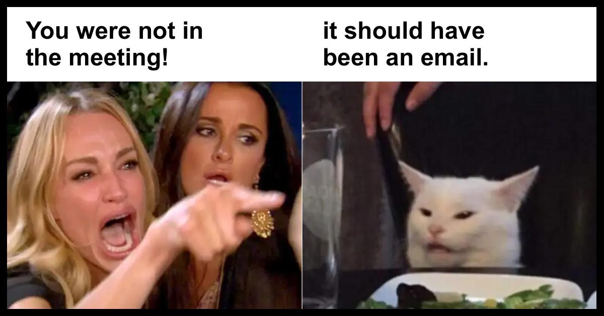

# Life in the lab

This is a collection of issues that I have found worthy of documenting explicitly. My experience has been that a lot of these 'lab-internal practices' tend to be communicated informally. By writing them down, I want to provide a mechanism to hold ourselves accountable (primarily, myself!).

## Expectations

- Adhere to [Code of conduct] at all times.
- Set goals for [Commitment and scholarly output] and [Manuscript writing].
- Communicate regularly with me about your [Career development].
- Keep rigorous notes of all your work for proper [Documentation].
- Attend [Practice presentations].
- Attend [Journal Club]. 
- Attend [Conferences & Events].

### Commitment and scholarly output

There are no 'hard rules' regarding scholarly productivity, but a good rule of thumb is to aim for approximately 1.5-2 first-author papers to publish every year. This is an output rate that will put you on a clear path to competitiveness for early-career grants after 2-3 years of doing a postdoc. As you gain more experience, the process of writing (and revising) papers becomes more familiar, which doesn't always mean 'easier'.

We strive to divide our projects up in such a way that everyone can contribute to each other's work. That not only broadens our horizons and skillsets and strengthens our group-connective tissue, but it also justifies co-authorship, which is beneficial for everyone involved. We typically decide ahead of time how to divide the labor involved in a particular project. 

If you take the lead (i.e. first authorship) on a project, it is expected that you assume responsibility and ownership of it, i.e. that you coordinate the experimental plan, conduct data analysis, write the first manuscript draft, and run the logistics and communication with your co-authors. 

### Sharing your work internally

In keeping with our dedication to the principles of open science, you are expected to share your work with your colleagues. That includes (well-documented and annotated) code, Illustrator figures, slide decks, notes, manuals, instructions etc. For frequently used resources, we keep a shared document folder - if you have created something useful, please place it in there for posterity.

## Meetings

When are you expected to be in the same room as your lab colleagues?

### Regular group meetings

I firmly believe two things about meetings:

1. A meeting between more than two people should only be held if necessary.
2. A meeting should only be held with a clear agenda.

If I call a group meeting, I will announce its intention, motivation, and agenda through Slack. Reasons for group meetings may include:

- Strategic planning of new projects or next papers
- [Practice presentations]
- Resolution of conflicts
- Important announcements of policy changes, structural changes to the group, etc.

I will try to respect your schedule and to-do lists, and give you sufficient notice (at least 1 day) before a group meeting, but I reserve the right to call emergency meetings under emergency circumstances.

Meetings that do not require the attendance of the entire group will be planned and scheduled by the parties that are involved (for example when discussing a particular data analysis step, or designing a figure). Attendance by interested group members is welcome and encouraged, but not expected.

### Individual meetings

Everyone has a different way of working - some like a lot of interaction with and immediate input from their supervisors, others prefer to tinker around for themselves and presents results in greater intervals. Mentor-mentee (and supervisor-supervisee) relationships can be super-hands-on or very removed.

I prefer that you work out the individual ways of accountability that works best for you. That means that we decide between us whether you prefer an active check-in from me on a daily, weekly, or biweekly basis, or whether you prefer me to expect that you are proactive and engaging when you get stuck and have questions.

The most important thing is that you don't spend a lot of time being stuck. It is my job and commitment to get you 'unstuck', help you be productive, and achieve your goals. If I notice that the individual meeting schedule may require adjustment, I will suggest more (or less) frequent meetings with you.

### Getting in touch with Georg (office hours)

If the door of my office is open, that means you are welcome to come in and ask for a chat. Sometimes, that may mean that I have only a few minutes to spare, but if the issue at hand requires more attention, we will schedule a follow-up at the earliest convenience.

(If the door is closed, please assume that I'm either not in, or doing focus work. Send a Slack message instead, I will respond as soon as I see it.)

### Practice presentations

Being able to clearly communicate and present your research is very important to advance your career in academia, but also for any other profession. Presentations at conferences and invited talks are one of the "coins of the realm" (the other being papers and grants) that determine your visibility and eligibility for advanced positions.

Fortunately, presenting well is not a natural talent. It is a set of skills that you can learn. If you are not comfortable presenting in front of a large group of people, or if your slide layout and messaging need some improvement, you will learn these skills during your time in the group. 

Practice presentations are an excellent way to improve your speaking skills. You will receive feedback from me and your labmates (and, if present, Richard Edden and Peter Barker) on your slide layout, figure design, talk structure, messaging, and spoken words. This feedback can be very detail-oriented. Detailed constructive feedback is **not** a sign of failure. It is the academic love language, and it means that the people giving you feedback are invested in helping you improve your skills.

Even if you already have great presentation skills, you are expected to practice your presentations in front of the group. This includes conference talks, power pitches, digital posters, educational presentations, and the 'go-to presentation' that you will develop over time as the one you give for invited talks. Every time you present, you will get better and more convincing.

### Journal club

Our group participates in a bi-weekly Journal Club with the Edden and Barker groups (every other Friday at noon). During Journal Club, we take turns presenting interesting, controversial, or educational papers that we stumble upon. Journal Club is a nice educational resource, particularly to learn from Richard Edden and Peter Barker (and there is pizza).

You are expected to attend Journal Club regularly, but scheduled data acquisition slots take priority. You are further expected to present once per presentation cycle, i.e. about once every half year.

## Conferences & Events

Conferences, meetings, courses, symposiums and workshops are important ways to 
- present your work to the wider research community
- meet peers inside and outside your field, forge new connections, and renew existing ones ("networking")
- learn new skills and techniques
- teach your skills to others.

### Essential and non-essential events

In our group, you are encouraged and expected to participate in events. There are some events that are essential* to our community, such as the annual meeting of the ISMRM, EDITINGSCHOOL, and the bi-annual International GABA symposium, and you will be expected to submit abstract to these events, and prepare posters, digital posters, talks, or educational material.

You are encouraged to attend *non-essential* events, like educational workshops to learn new skills, for example sequence development courses, biostatistical courses, etc.

### Abstracts, posters, talks

Throughout the year, we will keep a keen eye on abstract deadlines for our essential events. In the group, we will decide a few months ahead of time which ongoing projects we want to shape into abstracts. You are invited and encouraged to propose your own ideas for abstracts.

If the abstract gets accepted, you can begin working on the material, regardless of whether it is a poster, a digital poster, or a talk.

Each poster, digital poster, and talk will be [diligently reviewed and practiced in the group][Practice presentations].

### Financial support and reimbursement

Our funding will pay for all your event-related expenses for the essential events from his grant and departmental start-up funds. I will also make sure you can attend additional events, depending on the purpose of the event, the amount of expenses, the schedule, and of course equity within the group.

Because of the way that the university financial system works, common practice is for you to pay the expenses upfront, and then submit requests for reimbursement. Please contact me if you feel concerned about not being able to make payments ahead of time, and we will find a solution together.

Please see the [Conferences, workshops, courses] section for more detailed policies about coverage of cost for work-related travel.

## Career development

My first and foremost job is to help you pursue the professional and personal career that you see yourself in. We try and shape the work that you do in such a way that it benefits the next career step you envision. While research outputs (i.e. papers, presentations, and shared resources) are the coin of the realm, we have sufficient flexibility to weigh the different aspects of generating them in your daily work, depending on whether you would like to work in industry, continue in academia, or are looking for something hybrid, like a clinician scientist for one of the MR manufacturers.

### Individual Development Plan (IDP)

One efficient tool to discuss your short and long term goals is the annual IDP ([you can find a template here](https://www.hopkinsmedicine.org/som/offices/pda/training-resources/idp_template.html)). Together, you and I will identify the next projects you work on, the skills you will learn in that process, and development resources that can help you grow (like coursework, mentoring, etc.).

The IDP is also important to create accountability. Explicitly writing out expectations clarifies them for both the mentor and the mentee, and reduces the potential for friction and conflict.

## Documentation

We are committed to conducting our research in a way that makes it fundamentally possible for others to reproduce. That means, first and foremost, that you yourself are expected to be able to reproduce a certain analysis that you did a while ago. Proper documentation of what you are doing in every data analysis step is important - mostly for your future self who will want to understand what a certain line of code does, why a certain dataset was excluded from further analysis (and for which reason), or which exam card parameter setting was used for the fourth MRS scan of participant 091 on November 19 2024. 

Data analysis (for each experiment!) should be performed as soon as possible after data acquisition, and you should write well-annotated code for this task that you can re-run much later, if necessary. Ideally, you make use of executable notebooks like RMarkdown, Jupyter Notebooks, or MATLAB Live Scripts - these are essentially text documents that allow you to embed and execute blocks of code. This type of interactive text is ideal to generate reproducible and repeatable data analysis while explaining to your future self (and ultimately, others!) what the analysis code is doing.

### Lab books

While a lot of our work is happening on our own computers nowadays, you need to keep a lab book. This is a written record of every experiment that you conduct, i.e. the procedures and settings, the observations you make, and the relevant thoughts connecting interpretation and next experiment. It is *not* your little scribble notebook to generate ideas or take meetings notes in. The lab book is a legal document that remains in the institution after you move on. There are cases in which lab books have been used to investigate cases of scientific misconduct, but also to determine who made an important discovery first (and when).

You are expected to keep a lab book to document your scanner experiments and the data analysis that you do on them. The NIH training center has a [great summary](https://www.training.nih.gov/assets/Lab_Notebook_508_(new).pdf) on what a lab book is (and isn’t) and how to keep a good one. You don’t have to buy it yourself - we have plenty of hardcover notebooks in stock.

## Grants (and work during grant cycles)

One of my main jobs is to keep the machine running that pays our salaries. In academia, that means applying for (and hopefully, ultimately rewarded with) 'grants', i.e. time-limited tranches of external funding (see also [Money]).

Funding for our work comes largely from the National Institutes of Health (NIH). [There are different fixed due dates for submitting grant applications, and they depend on the grant mechanism one wants to apply for.](https://grants.nih.gov/grants/how-to-apply-application-guide/due-dates-and-submission-policies/due-dates.htm) However, all of them typically offer three submission dates per year, dividing the year into three natural cycle periods of four months.

We don't submit a grant every cycle, but if we decide to do, the hard deadlines create some urgencies. In the weeks before a grant submission deadline, you will be asked to help generate figures, proof-read writing, provide biosketches and other information - sometimes on a somewhat tighter timeline than you are used to. 

If you are interested in writing your own grant eventually, these are also the times where you will have a great opportunity to look closer and learn the 'anatomy of an NIH grant' while you watch a grant application come into existence.

## Manuscript writing

For better or worse, the classic scientific paper remains the 'coin of the realm' to this day. It is your job as a scientist to generate knowledge, and the primary form of communicating this knowledge is the publishing of manuscripts.

Writing a scientific paper is not easy, but it can be learned. When you create your first drafts, you will receive help finding a good structure and determining which results we want to show in which form. You will also receive a lot of detailed feedback on your writing. In the beginning of your training, we may quite literally sit down and edit your document together word-by-word, and a heavily annotated Word document with lots of edits in the margin is a love language and a sign that your mentor cares! (See also [Practice presentations]!)

Here are a few really useful resources:

- [Ten simple rules for structuring papers](https://journals.plos.org/ploscompbiol/article?id=10.1371/journal.pcbi.1005619)
- [The Elements of Style](https://www.gutenberg.org/files/37134/37134-h/37134-h.htm)
- [Write Well - The Writing Handbook](https://www.julian.com/guide/write/intro)
- [21 Tactics to Help You Become a Better Writer](https://www.nateliason.com/blog/better-writer)

## Coding

Another essential skill in our profession is writing useful and flexible program code. There are more programming classes and courses than fish in the sea, but ultimately there is only one way to become a decent-enough programmer to get most of the job done: by choosing a project and diving head-first into it. 

None of us are computer scientists or trained programmers, and that is fine. Nevertheless, you are expected to write code that other people can use, too. That includes complete and comprehensible documentation, generous commenting throughout the scripts, a focus on flexible functions and methods (rather than single-purpose, hard-coded scripts), and meaningful variable names. The Osprey code is hopefully an example of what 'decent enough' code looks like - we all still learn as we go!

Most of [our own software development](https://github.com/schorschinho/osprey) is written in MATLAB. For our statistical analyses and documentation, our first port of call is R in RStudio (based on the philosophy of the [tidyverse](https://www.tidyverse.org/learn/)). Many useful tools in our community are also written in Python, and it is not entirely unlikely that we might shift further towards Python in the future as well. A lot of automation in scientific computing happens at the command line, i.e. using [shell scripting](https://www.shellscript.sh/) and Unix-style terminal commands. Lastly, new acquisition sequences for the Siemens and Philips MRI environments are written in vendor-specific flavors of C++. If you are interested in pulse programming and sequence development, you can attend the respective courses officially offered by the manufacturers (it is a highly useful skill!).

## Money

How do we pay for all this?

### Salary & health insurance

Your salary (as a postdoc) is paid according to the stipend levels by the NIH Ruth L. Kirschstein National Research Service Award. [Starting at $54,840 for a first-year postdoc in 2022](https://grants.nih.gov/grants/guide/notice-files/NOT-OD-22-132.html), the pay is slightly increased each calendar year (offering some sort of inflation adjustment), and also increases with the duration of the fellowship. Payment arrives twice a month (typically around the 1st and 15th day). 

Benefits include health insurance (with vision and dental care). Details can be found on the [website of the Office of Postdoctoral Affairs](https://restricted.hopkinsmedicine.org/som/Pdoc/benefits_faq.html).

### Sources of funding

Our funding currently comes from my K99/R00 grant "Towards a comprehensive neurometabolic profile in patients with mild cognitive impairment" (April 2021 - March 2024) from the National Institute on Aging (NIA), my R21 grant “General Linear Modeling for Magnetic Resonance Spectroscopy” (July 2022 - March 2025) from NIBIB, as well as my three-year start-up package from the Department of Radiology at Johns Hopkins University.

I will try to ensure that you will not have personal expenses for work-related activities within a reasonable amount, but reimbursement will ultimately depend on available funds, equity among group members, and common sense (for details, see below).

### Conferences, workshops, courses

You are expected to submit abstracts to the key international conferences (ISMRM, OHBM), and participate in events we are involved in organizing (International Symposium on MRS of GABA; EDITINGSCHOOL). I will further actively support and promote the attendance of workshops and courses (ISMRM, sequence development courses) that broaden your skills and make you competitive for your future career.

You can get reimbursed for society memberships, conference fees, travel, accomodation, and food/drinks.  **All group members are strongly encouraged to apply for travel stipends, conference scholarships, trainee awards etc. to win additional support. I will happily provide letters of reference or recommendation, or proof of traineeship.**

If you want to attend more than 2-3 conferences or workshops in a single calendar year, please talk to the remaining lab members about it. Conference travel is a privilege - one that is extremely important for your career development, but be aware of using available funds responsibly and in an appropriate and team-oriented manner.

### Technical equipment and software licenses

Assuming that sufficient funding is available, I will provide each group member with a work computer, peripherals, and storage/backup devices. Please do not use your personal devices for work, as it is imperative for us to comply with data privacy and security guidelines.

If you need to buy additional hardware or purchase a software license, check with me so that I can order what you need directly through JHU, and charge directly to one of our accounts.

